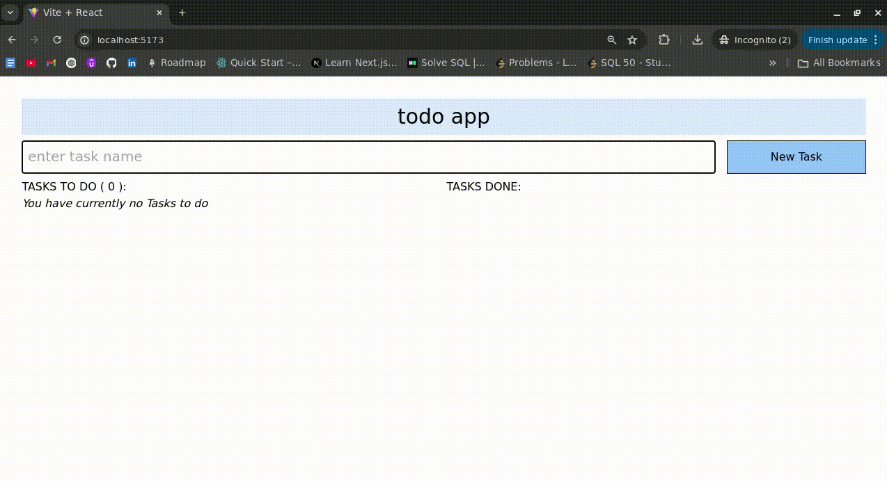

# React To-Do App

A simple and responsive To-Do application built with React and Tailwind CSS, powered by Vite for fast development and performance.

## Features

- Add, edit, and delete tasks
- Mark tasks as completed
- Responsive UI with Tailwind CSS
- Fast and optimized development with Vite

## Tech Stack

- **React**: Frontend framework
- **Vite**: Fast development build tool
- **Tailwind CSS**: Utility-first styling
- **ESLint**: Code linting and formatting

## Installation & Setup

1. **Clone the repository:**
   ```bash
   git clone https://github.com/SaadSohailBajwa/react-todo.git
   cd react-todo
   ```
2. **Install dependencies:**
   ```bash
   npm install
   ```
3. **Run the development server:**
   ```bash
   npm run dev
   ```
4. **Build for production:**
   ```bash
   npm run build
   ```

## Demo




## Contact

For any queries or feedback, feel free to reach out:
- **GitHub**: [SaadSohailBajwa](https://github.com/SaadSohailBajwa)
- **Email**: saadsohailbajwa@gmail.com


